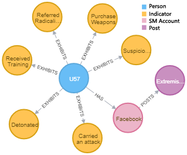
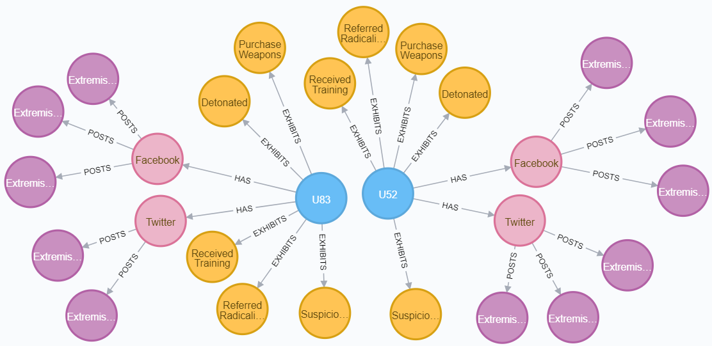
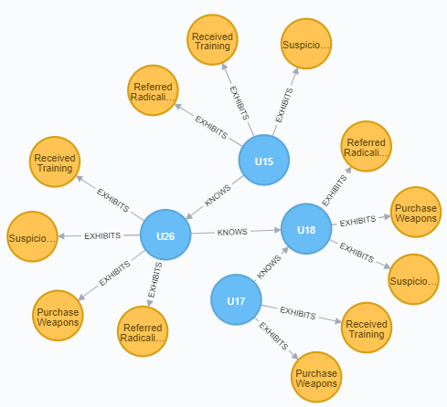

## PINGS 1.0 (<u>P</u>rocedures for <u>IN</u>vestigative <u>G</u>raph <u>S</u>earch)

An investigative pattern detection algorithm, which based on sub-graph pattern matching using a scoring mechanism and implemented on [Neo4j](https://neo4j.com) graph database.
We implemented several [Neo4j user-defined procedures](https://neo4j.com/docs/java-reference/current/extending-neo4j/procedures-and-functions/procedures/) 
to address different aspects of the investigative search. The investigative algorithm can be widely used to evaluate
 and track individuals or groups based on latent or emergent behaviors
  in homeland security, cyber security, behavioral health, consumer analytics, etc. 

For more details, please refer our paper and more to come, 
 doi : [10.1109/GC46384.2019.00017]("https://doi.org/10.1109/GC46384.2019.00017)

And highly recommend to cite our paper. 
```{
@INPROCEEDINGS{9030966,
    author={S. R. {Muramudalige} and B. W. K. {Hung} and A. P. {Jayasumana} and I. {Ray}},
    booktitle={2019 First International Conference on Graph Computing (GC)}, 
    title={Investigative Graph Search using Graph Databases}, 
    year={2019},
    pages={60-67}
    }
```

Identify individuals that satisfy a given query graph. 
##### 1. individualSimilarity(similarityThreshold, redFlagMultiple, queryLabel, queryFocusLabel)

Identify groups that collectively satisfy a given query graph. 
##### 2. neighborhoodSimilarity(similarityThreshold, redFlagMultiple, queryLabel, queryFocusLabel)

### Example

###### Query Graph



- *eg : individualSimilarity(0.7, 2, ‘l query’, ‘Person’)* <br>


- *eg : neighborhoodSimilarity(0.7, 1, ‘l query’, ‘Person’)* <br>


### Input Parameters

- *similarityThreshold* – A similarity score is calculated for each user based on his activities. It is normalized to range (0,1). 
The query graph score similarityThreshold is used to identify matching subgraphs.
- *redFlagMultiple* – This attribute is used to highlight the highest risk activities/indicators. 
The *redFlagMultiple* (≥ 1) is used to multiply (weight) high-risk activities as a weighted (multiplicative) value.
 The end result is a prioritization of sub graphs by similarity score due to the presence of high-risk activities.
- *queryLabel* – A node in a Neo4j graph database can have multiple labels. 
This allows us to identify a query graph within the database by appending another label (eg: *‘l_query’*). 
Therefore, the query graphs can be easily updated for different experiments, which the algorithm picks up within the database itself.
- *queryFocusLabel* – The node label indicates the starting point of the algorithm. In our context, we have to provide the 
label of the person, *‘Person’*. Then the algorithm scans all the persons and evaluates the similarity measure for each person.


### Prerequisites

You have to install both Java and Neo4j graph database. 
- Java version >= 8
- Neo4j >= 3.2

### License
This program is free software: you can redistribute it and/or modify it under the terms of the GNU General Public License as published by the Free Software Foundation, version 3 of the License (GNU GPLv3).


### Contact Us
We are Computer Networking Research Lab (CNRL), Department of Electrical & Computer Engineering, Colorado State University, USA.\
[cnrl@engr.colostate.edu](mailto:cnrl@engr.colostate.edu) \
[shashika@colostate.edu](mailto:shashika@colostate.edu)